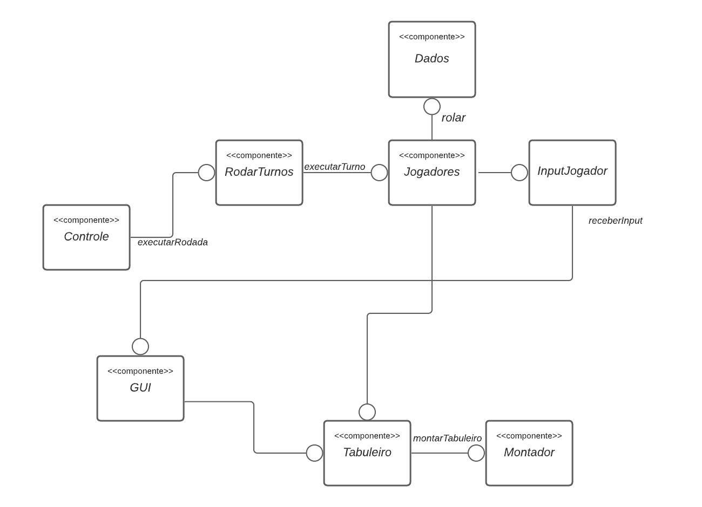
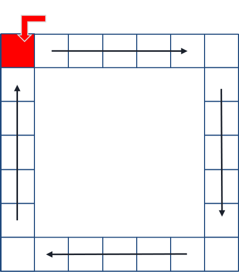
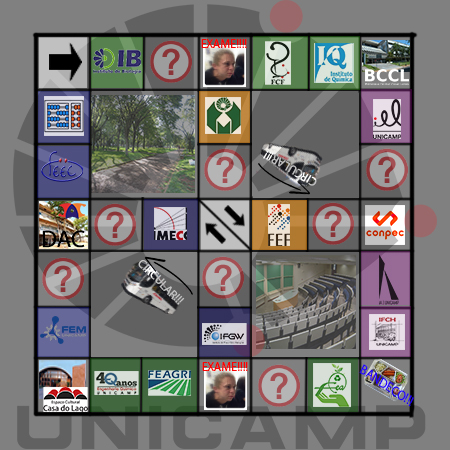

# Projeto `Tente Nao Jubilar`

# Descrição

   O Tente Não Jubilar é uma versão adaptada do Monopólio (Ou Banco Imobiliário) para o mundo universitário, em que o objetivo é acumular Créditos através de fazer aulas e provas, seus adversários deverão parar nos institutos também para fazer as aulas que você já fez, gerando mais créditos!

# Equipe
* `<Gabriel Bonfim Silva de Moraes>` - `<216111>`
* `<Leandro Ponsano Corimbaba>` - `<239084>`

# Vídeos do Projeto

> Segue o [vídeo do projeto.](https://drive.google.com/file/d/1C1yYbuWAi0JLtMh-GVp5yADwuRK5mTpg/view?usp=sharing)

# Slides do Projeto

> Segue os [slides do projeto.](/assets/outdated_assets/TrabalhoMC322.pptx)

# Diagrama Geral (será atualizado até o fim do projeto)

# Tabuleiro e Peças Utilizadas

## Tabuleiro Antigo:

## Tabuleiro Atualizado:

>Atualizamos o tabuleiro para deixa-lo mais complexo, criando atalhos e novas instituições.

