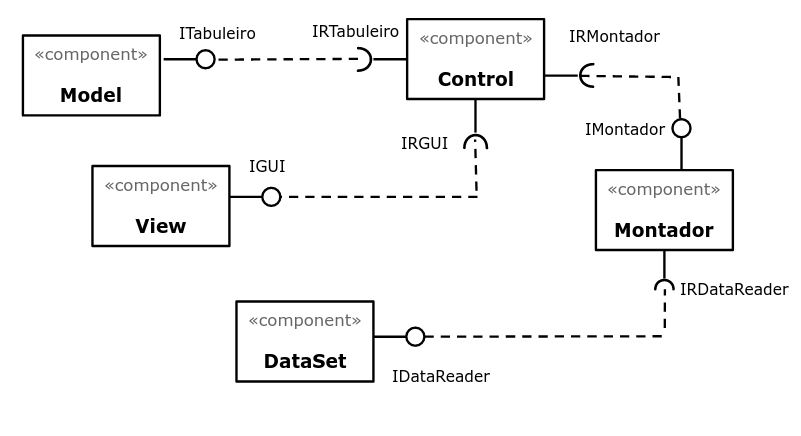
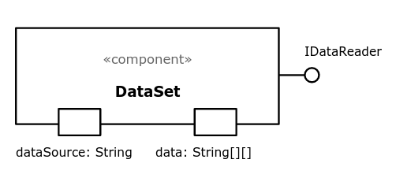
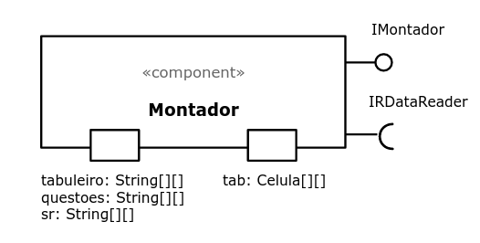
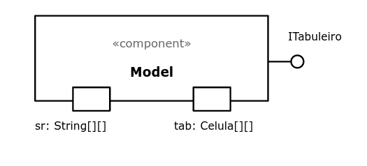
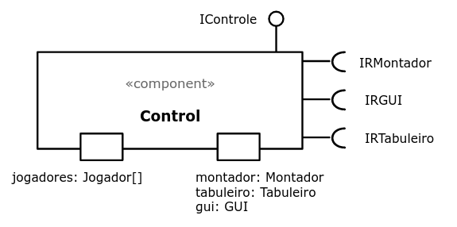
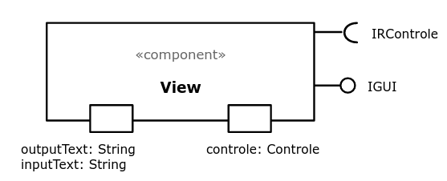

# Projeto Tente Nao Jubilar

# Descrição Resumida do Projeto/Jogo
O Tente Não Jubilar é uma versão do Monopólio (ou Banco Imobiliário) adaptada para o mundo universitário, em que o objetivo é acumular créditos fazendo aulas e provas. Seus adversários também deverão parar nos institutos da Unicamp para fazer as aulas que você já fez, gerando mais créditos! Vence o indíviduo que conseguir 2000 créditos para passar de ano sem jubilar.

# Equipe
* Gabriel Bonfim Silva de Moraes - 216111
* Leandro Ponsano Corimbaba - 239084

# Vídeos do Projeto
## Vídeo da Prévia
Segue o [vídeo da prévia.](https://drive.google.com/file/d/1C1yYbuWAi0JLtMh-GVp5yADwuRK5mTpg/view?usp=sharing)
## Vídeo do Jogo
A colocar.

# Slides do Projeto
## Slides da Prévia
Segue os [slides da prévia.](/assets/outdated_assets/TrabalhoMC322.pptx)
## Slides da Apresentação Final
A colocar.
## Relatório de Evolução
Veja o [progresso](Progresso.md).

# Destaques de Código
A colocar.

# Destaques de Pattern
## Diagrama do Pattern
A colocar.
## Código do Pattern
A colocar.

# Conclusões e Trabalhos Futuros
A colocar.

# Documentação dos Componentes
# Diagramas
## Diagrama Geral do Projeto
A colocar.
## Diagrama Geral de Componentes

## Componente dataSet
Responsável pela leitura dos arquivos de entrada, que contém informações importantes como: mapa do tabuleiro, custos e aluguéis, perguntas e respostas, efeitos do Sorte ou Revés e outros.  

## Componente Montador
Responsável por montar o tabuleiro, recebendo as informações do dataSet e passando a matriz de célula para o tabuleiro. É "contratado" pelo Control.  

## Componente Model
Representa o espaço celular, ou seja, o tabuleiro e as células. Realiza a movimentação dos jogadores e executa o efeito de cada célula.  

## Componente Jogador
Representa cada universitário, e armazena sua quantidade de créditos e as propriedades que possui.  
A colocar.

## Componente Control
Será o responsável por conduzir o jogo, as rodadas e os turnos.  

## Componente View
Contratado pelo Control, é quem transporta o jogo para a interface gráfica criada.  

