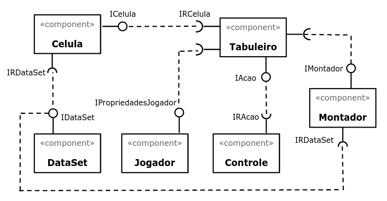
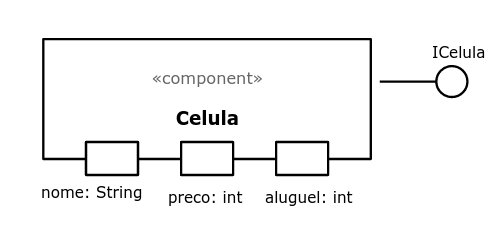
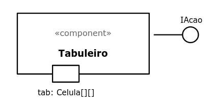
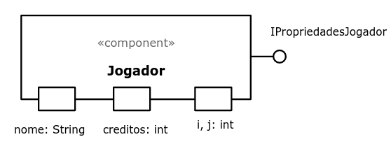
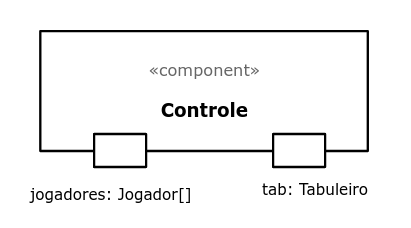
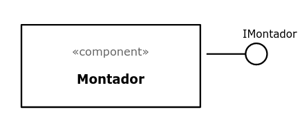
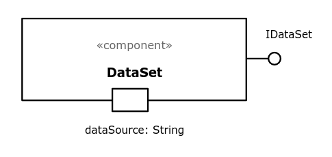

# Projeto Tente Nao Jubilar

# Descrição Resumida do Projeto/Jogo
O Tente Não Jubilar é uma versão adaptada do Monopólio (Ou Banco Imobiliário) para o mundo universitário, em que o objetivo é acumular Créditos através de fazer aulas e provas, seus adversários deverão parar nos institutos também para fazer as aulas que você já fez, gerando mais créditos! Vence o indíviduo que conseguir uma certa quantidade de créditos para passar de ano sem jubilar.

# Equipe
* Gabriel Bonfim Silva de Moraes - 216111
* Leandro Ponsano Corimbaba - 239084

# Vídeos do Projeto

> Segue o [vídeo do projeto.](https://drive.google.com/file/d/1C1yYbuWAi0JLtMh-GVp5yADwuRK5mTpg/view?usp=sharing)

# Slides do Projeto

> Segue os [slides do projeto.](/assets/outdated_assets/TrabalhoMC322.pptx)

# Documentação dos Componentes
## Diagramas
### Diagrama Geral do Projeto
Será atualizado até o fim do projeto.

### Diagrama Geral de Componentes

### Componente Celula
Representa cada célula do tabuleiro, e pode ser do tipo Instituto, Empresa, Sorte Ou Revés e outros. Armazenará os preços de compra e aluguel.

### Componente Tabuleiro
Sera compostO por uma matriz de células, e fará a movimentacão dos jogadores, bem como lhe oferecer a compra de propriedades.

#### Ficha Técnica

### Componente Jogador
Representa cada universitário, e armazena sua quantidade de créditos e as propriedades que possui.

### Componente Controle
Será o responsável por conduzir o jogo, as rodadas e os turnos.

### Componente Montador
Será o responsável por criar as células e montar o tabuleiro.

### Componente DataSet
Esse componente fará o intermédio entre os outros componentes e os arquivos na pasta `data` (arquivos de entrada).

# Tabuleiro e Peças Utilizadas

## Tabuleiro Antigo:

## Tabuleiro Atualizado:
Atualizamos o tabuleiro para deixa-lo mais complexo, criando atalhos e novas instituições.

